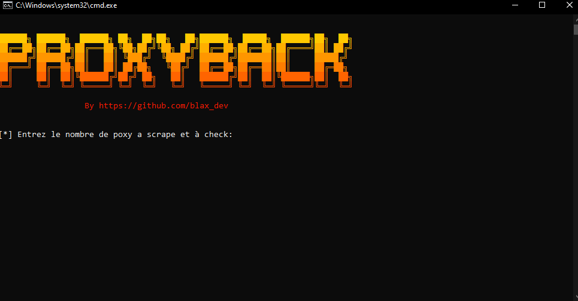

# 🕵️‍♂️ **ProxyBack-Tool** 🌐

 

**ProxyBack-Tool** est un outil conçu pour scraper et vérifier des proxys publics. Il récupère des proxys depuis des sites en ligne, puis teste leur validité. Cela permet de filtrer les proxys qui fonctionnent réellement et de les sauvegarder pour une utilisation future.

🌐 **Scraping et Vérification de Proxys**  
L'outil collecte des proxys depuis des sources comme `sslproxies.org` et `free-proxy-list.net`, puis vérifie leur disponibilité.

---

## 🚀 **Fonctionnalités principales** :

- **Scraper** des proxys HTTP, HTTPS et SOCKS.
- **Vérifier** leur validité en effectuant des tests.
- **Sauvegarder** les proxys valides dans un fichier `valid-proxies.txt`.

---

## 📊 **Utilisation** :

1. Lancez l'outil.
2. Choisissez combien de proxys vous souhaitez vérifier.
3. L'outil scrappe les proxys et les teste.
4. Les proxys valides sont sauvegardés dans `valid-proxies.txt`.

---

## 💬 **Informations de développement** :

- **Développeur** : blax_dev
- **Version** : 1.0
- **Discord** : [Rejoindre le serveur Discord](https://discord.gg/backgen)
- **SiteWeb** : [Backgen.com](https://backgen.onrender.com/)
